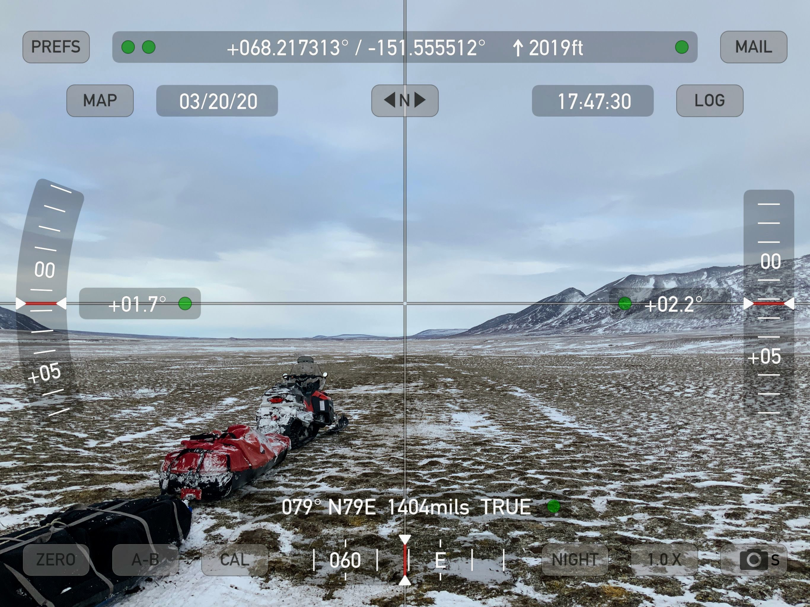
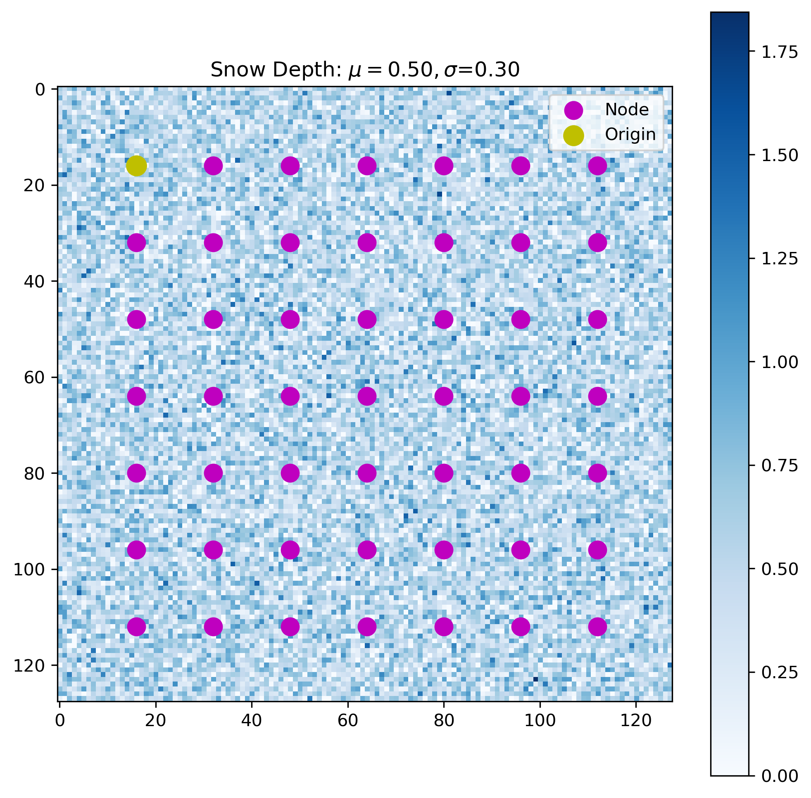
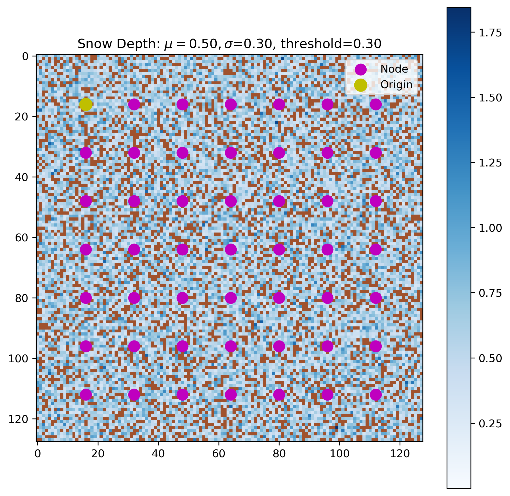
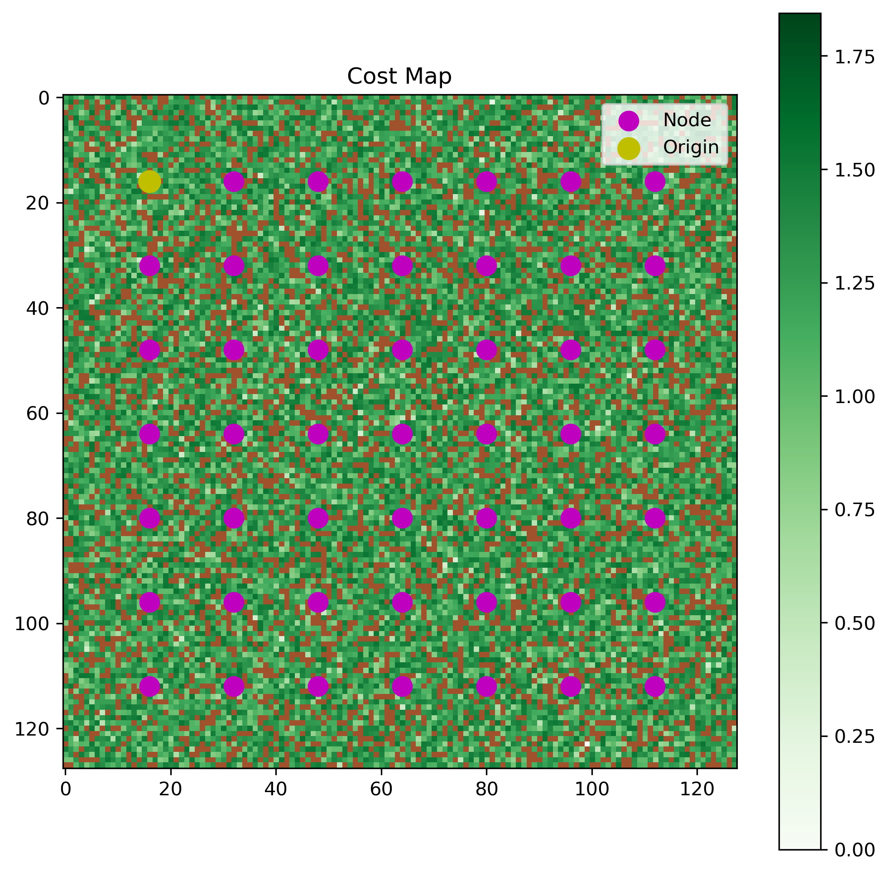
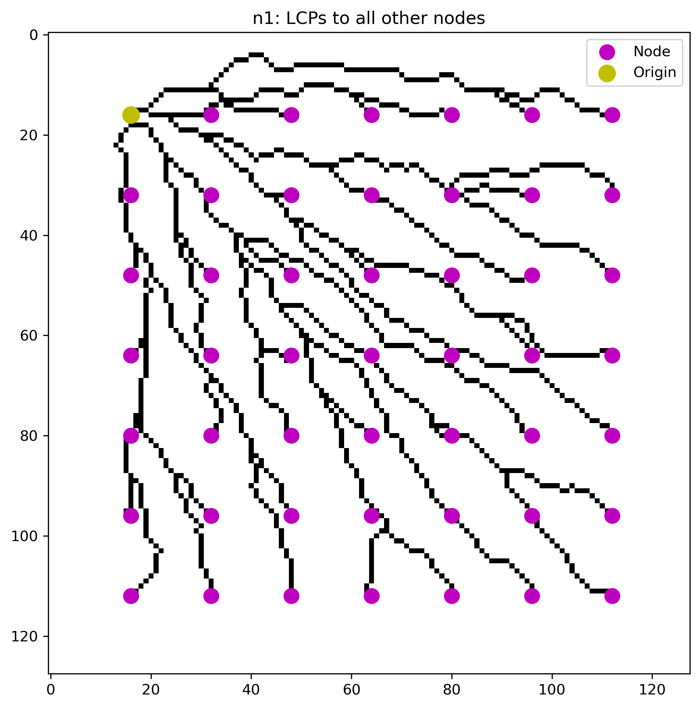
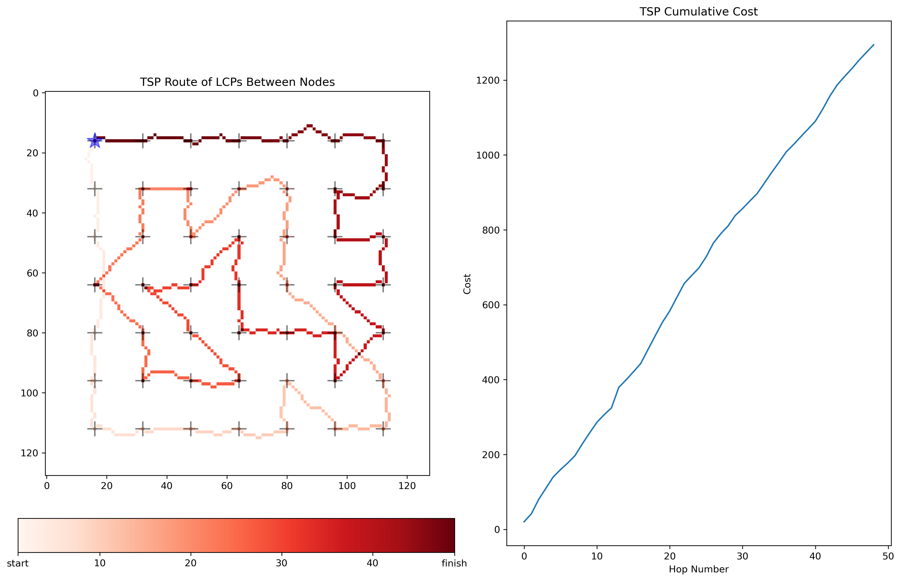
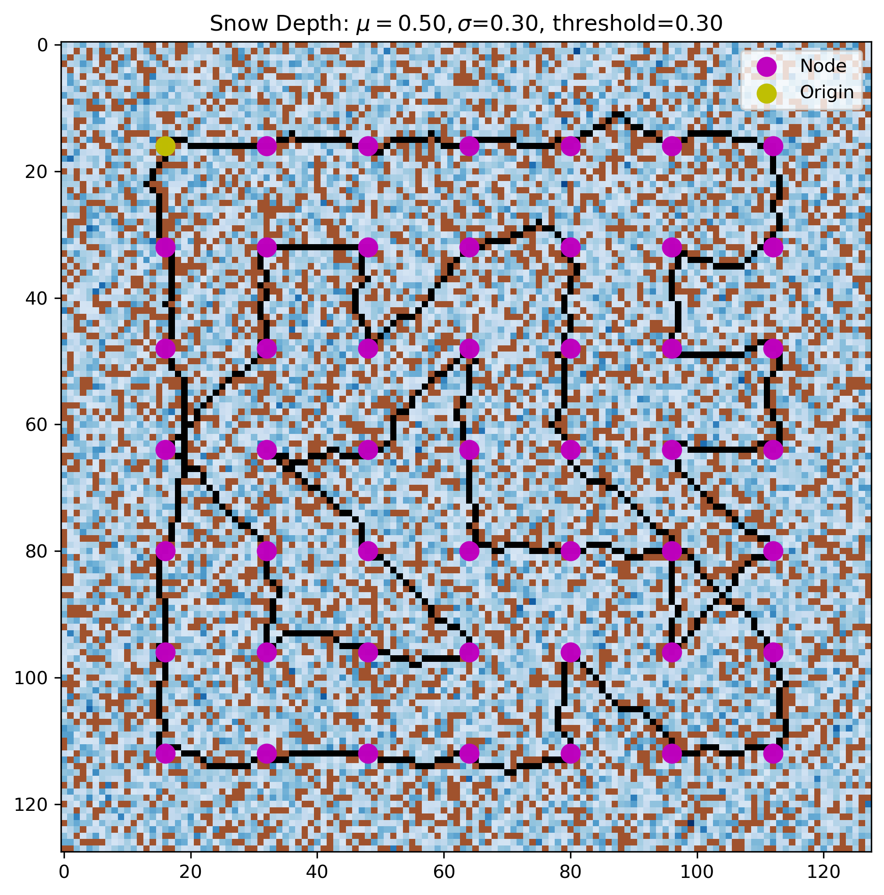
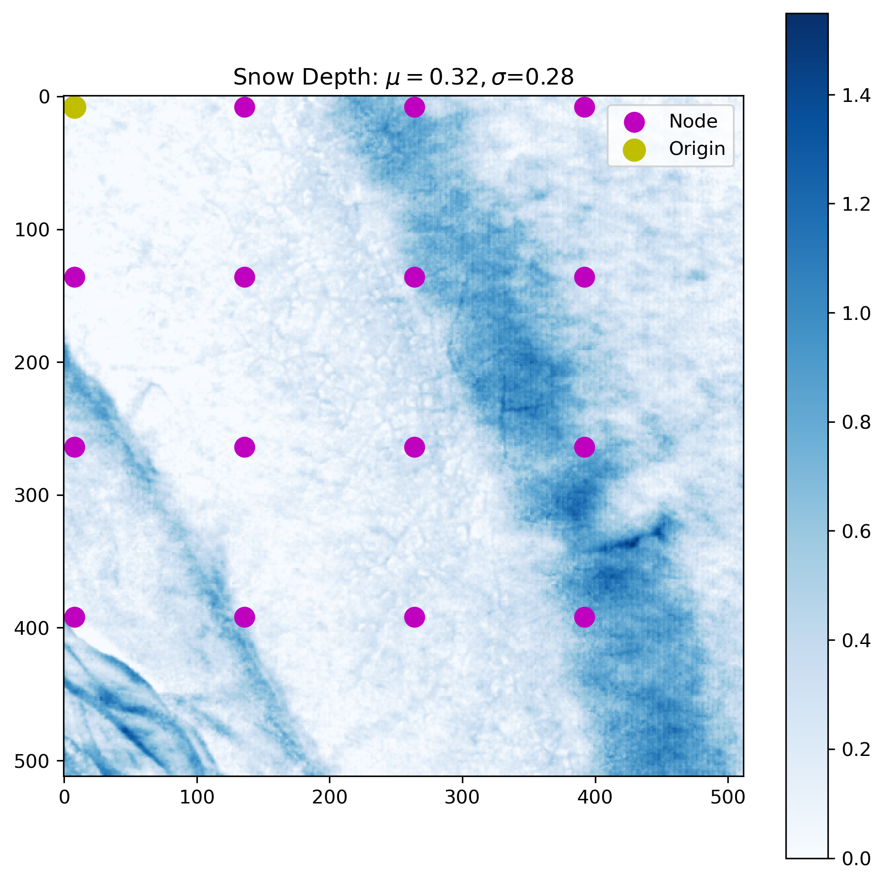
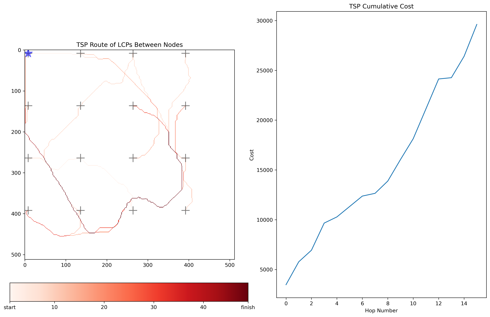
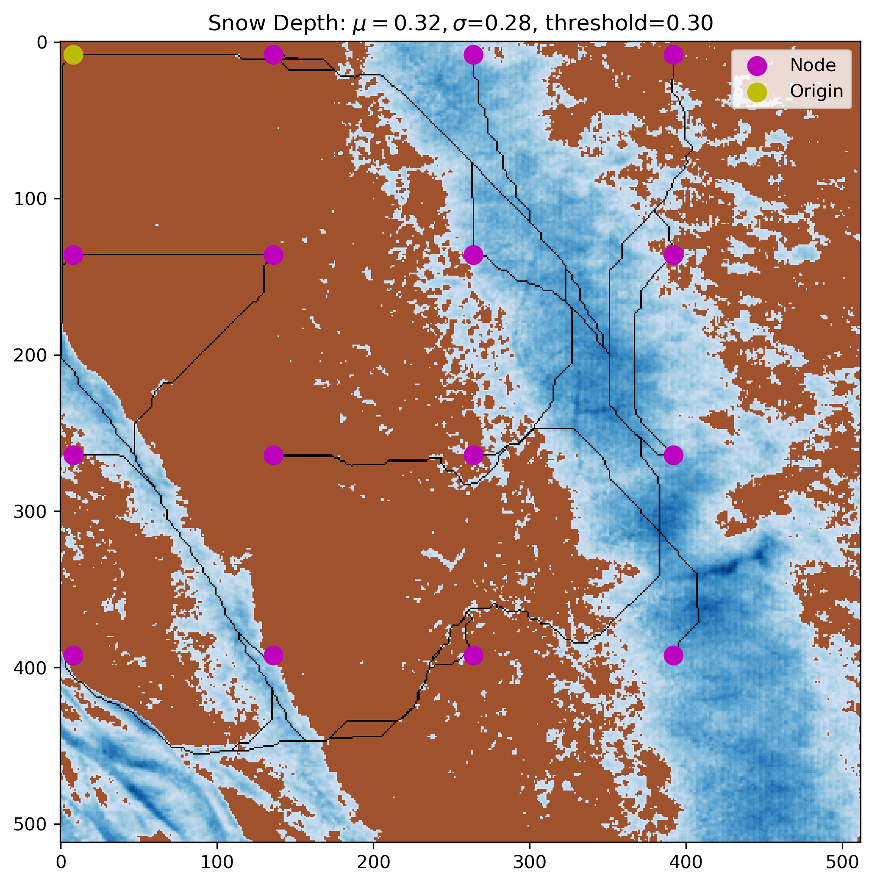

# The Traveling Snowman Problem

## How to most efficiently navigate a snowy landscape while minimizing travel over thin snowcover?

In this example we will use a synthetic snow-covered world overlain by a regular grid of nodes. Each node must be visted once and only once, and the first and last node must be the same, meaning that we enter and exit the node survey at the same location. We seek to minimize travel over shallow depths and attach a 10X traveling cost penalty to cells where the snow depth is less than 0.30 m.

## Approach
### Construct a synthetic snow depth map and some nodes to be visited

#### Compute a cost surface derived from the snow map
- Greater snow depths correlate with cheaper travel.
- Shallower depths are more expensive.
- Snow depths below a certain threshold are 10X more expensive.

In this simple example we invert the snow depth map and apply a 0.30 m threshold.

##### Snow depths below the threshold are colored brown

##### 10X cost locations (i.e. snow depth < threshold) are colored brown. Color map is green for $$$.

#### Compute least cost paths (LCPs) for each node to all other nodes
Computation of the LCPs is akin to generating a distance matrix. However, the distance is defined by the cost to get from one node to another along the cost surface, rather than the actual geographic distance. The cost from one node to another is the sum of the costs along the path. The LCPs are stored in a dictionary where each key is a node that stores the LCPs to all other nodes. Diagonal movements are allowed.

##### Node 1 (Origin)

#### Implement a traveling salesman problem (TSP) algorithm

We have now contructed the cost landscape that the sales(snow)man will travel and measured the distances (i.e. LCPs) between the cities (nodes). Now that the landscape is built and mapped, the snowman is ready to travel. Many implementations of the TSP exist. I use a [simulated annealing](https://en.wikipedia.org/wiki/Simulated_annealing?oldformat=true) approach which is a probalistic method, rather than a genetic algorithm. Each node is visted once and once only, we start and end at the origin, and there is no back-tracking. Credit to Eric P. Hanson for the implementation which is adapted from his fantastic blog post ["The traveling salesman and 10 lines of Python").](https://ericphanson.com/blog/2016/the-traveling-salesman-and-10-lines-of-python/)

In this instance 10 million different tours are created by simply swapping the visit order of two of the nodes each time. Each time the tour distance is compared to that of the previous tour, and if the distance is shorter, the new tour is retained for the next iteration.

## Results

## With a Real Snow Depth Map!
Results from a subset of Camden Bay in the Arctic National Wildlife Refuge

## Next
- Rectify some of the namespace madness
- Move plots to a seperate module
- Implement a Genetic Algorithm
- Enable backtracking
- Handle potential math overflow errors
- Enable "mining" and "bridge building" to pull snow from deep areas to thin areas
